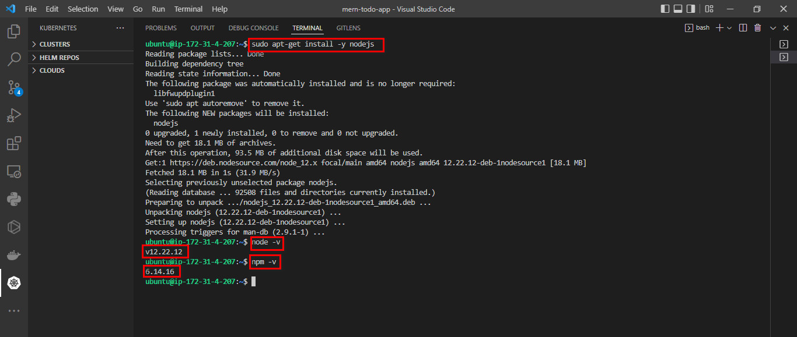
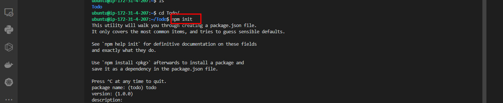

# Deploying a MERN Stack Application on AWS Cloud

A MERN stack consists of a collection of technologies used for the development of web applications. It comprises of MongoDB, Express, React and Node which are all JavaScript technologies used for creating full-stack applications and dynamic websites.

**MongoDB**: is a document-oriented NoSQL database technology used in storing data in the form of documents.

**React**: a javascript library used for building interactive user interface based on components.

**Express**: its a web application framework of Node js which is used for building server-side part of an appication and also creating Restful APIs.

**Node**: Node.js is an open-source, cross-platform runtime environment for building fast and scalable server-side and networking applications.

We will be building a simple todo list application and deploying on AWS cloud EC2 machine.

## Creating EC2 Instances
We log on to AWS Cloud Services and create an EC2 Ubuntu VM instance. When creating an instance, choose keypair authentication and download private key(*.pem) on your local computer.


On windows terminal, cd into the directory containing the downloaded private key.Run the below command to log into the instance via ssh:

ssh -i <private_keyfile.pem> username@ip-address


## Configuring Backend

Run `sudo apt update` and `sudo apt upgrade` to update all default ubuntu dependencies to ensure compatibility during package installation.


Next up will be to install nodejs, first we get the location of nodejs form the ubuntu repository using the following command.
`curl -sL https://deb.nodesource.com/setup_12.x | sudo -E bash -`
 
 Then we run a node install<br/>
 `sudo apt-get install -y nodejs`
 
 

### **Setting up the application**
We then create a directory that will house our codes and packages and all subdirectories to represent components of our application. <br/>
`mkdir todo`<br/>
Inside this directory we will instantiate our project using `npm init`. This enables javascript to install packages useful for spinning up our application.



## Express installation
We will be installing express which is nodejs framework and will be helpful when creating routes for our application via HTTP requests.<br />
`npm install express`


Create an `index.js` file which will contain code useful for spinning up our express server

Install the `dotenv` module which is a module that loads environment variables from a `.env` file into `process.env`. The `.env` files are useful for hiding important credentials which shouldnt be exposed.<br/>
`npm install dotenv`.<br/>

Inside the `index.js` file we type the following the code as seen in the image below.


Run `node index.js` to spin up our server.

This code is useful for spinning up our application via the port specified in the code.

Allow our port as part of the inbound security rules in our EC2 instance to ensure that our server is visible via the internet.


Paste our public ip address on the browser with the port to see if the server is properly configured.


## Defining Routes For our Application
We will create a `routes` folder which will contain code pointing to the three main endpoints used in a todo application. This will contain the post,get and delete requests which will be helpful in interacting with our client_side and database via restful apis.
```
mkdir routes
cd routes
touch api.js
```
 Write the The below code in `api.js`. It is an example of a simple route that fires various endpoints. 

 ```
 const express = require ('express');
const router = express.Router();

router.get('/todos', (req, res, next) => {

});

router.post('/todos', (req, res, next) => {

});

router.delete('/todos/:id', (req, res, next) => {

})

module.exports = router;
 ```

 ## Creating models
 We will be creating the models directory which will be used to define our database schema. A Schema is a blueprint of how our database will be structured which include other fields which may not be required to be stored in the database.

 Inside the `todo` directory, run `npm install mongoose` to install mongoose.

 Create a `models` directory and then create a file in it `todo.js`
 Write the below code inside the todo.js file


Since we have defined a schema for how our database should be structured, we then update the code in our `api.js` to fire specific actions when an endpoint is called.

```
const express = require ('express');
const router = express.Router();
const Todo = require('../models/todo');

router.get('/todos', (req, res, next) => {

//this will return all the data, exposing only the id and action field to the client
Todo.find({}, 'action')
.then(data => res.json(data))
.catch(next)
});

router.post('/todos', (req, res, next) => {
if(req.body.action){
Todo.create(req.body)
.then(data => res.json(data))
.catch(next)
}else {
res.json({
error: "The input field is empty"
})
}
});

router.delete('/todos/:id', (req, res, next) => {
Todo.findOneAndDelete({"_id": req.params.id})
.then(data => res.json(data))
.catch(next)
})

module.exports = router;
```
